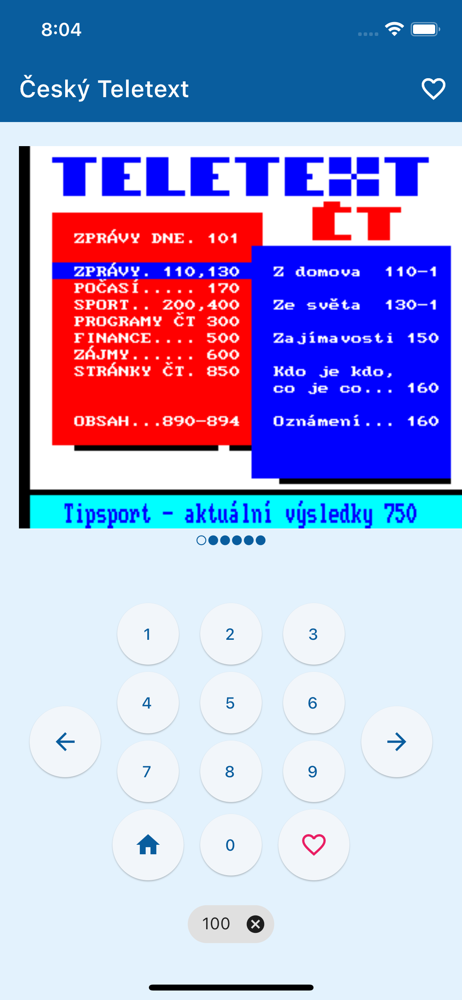

# Český Teletext

Klasický teletext -  mobilní kabátek. Čerpejte informace z jednoho z nejkvalitnějších zdrojů informací, který znáte z obrazovek České televize.
Nenechte se rušit od čtení zpráv, počasí, výsledků sportovních zápasů a mnoho dalšího. Konzumujte je snadno a jednoduše ve svém mobilu. Stránky si můžete přidat mezi oblíbené. A v neposlední řadě si dvojím kliknutím na stránku teletextu ji můžete také zvětšit.

## Screenshoty

## Stažení aplikace

-   [Google Play](https://play.google.com/store/apps/details?id=com.danielrataj.ceskyteletext)
-   [App Store](https://apps.apple.com/us/app/%C4%8Desk%C3%BD-teletext/id1626040724)

### Vývoj aplikace

V případě, že chcete aplikaci upravit, další informace najdete na [stránce s vývojem](/docs/development.md).

### Ochrana osobních údajů

Více o tom, jak nakládáme s [osobními údaji](/docs/privacy-policy.md).
